# Motion Sensor

This example demonstrates using the motion sensor with the CYW208xx and CYW207xx devices using ModusToolbox IDE.

## Requirements

- [ModusToolbox™ IDE](https://www.cypress.com/products/modustoolbox-software-environment) v2.0  
- Programming Language: C
- Associated Parts: 
[CYW20819](https://www.cypress.com/datasheet/CYW20819), [CYW20820](https://www.cypress.com/datasheet/CYW20820), [CYW20719](https://www.cypress.com/datasheet/CYW20719), [CYW20721](https://www.cypress.com/datasheet/CYW20721)

## Supported Kits
-  [CYW920819EVB-02 Evaluation Kit](http://www.cypress.com/CYW920819EVB-02) 
-  [CYW920820EVB-02 Evaluation kit](http://www.cypress.com/CYW920820EVB-02)  
-  [CYW920719B2Q40EVB-01 Evaluation kit](http://www.cypress.com/CYW920719B2Q40EVB-01)
-  [CYW920721EVB-01 Evaluation kit](http://www.cypress.com/CYW920721EVB-01)

Simply pick the supported kit in the IDE's 'New Application' wizard. When you select a supported kit in the new application wizard, the example is reconfigured automatically to work with the kit. 

To work with a different supported kit, use the middleware selector to choose the BSP for the supported kit. You can also just start the process again and select a different kit.

If you want to use the application for a kit not listed here, you may need to update source files. If the kit does not have the required resources, the application may not work.

## Hardware Setup

This example uses the kit’s default configuration. Refer to the kit guide to ensure that the kit is configured correctly. A wire needs to be connected from the on-board motion sensor to the D6/J4.2 on the device. See the following table to know the connections for different kits:

##### Table 1. Hardware Setup

|**Kits**|**Motion Sensor Interrupt**|**BLE Device Connection**|
|--|--|--|
|CYW920819EVB-02|J17.1|D6|
|CYW920820EVB-02|J17.1|D6|
|CYW920719B2Q40EVB-01|TP1|D6|

## Software Setup

This code example consists of two parts: a locator and a target. For the locator, download and install the CySmart app for [iOS](https://itunes.apple.com/us/app/cysmart/id928939093?mt=8) or [Android](https://play.google.com/store/apps/details?id=com.cypress.cysmart&hl=en). 

You can also use the [CySmart Host Emulation Tool](http://www.cypress.com/go/cysmart) Windows PC application if you have access to the [CY5677 CySmart BLE 4.2 USB Dongle](http://www.cypress.com/documentation/development-kitsboards/cy5677-cysmart-bluetooth-low-energy-ble-42-usb-dongle).

Scan the following QR codes from your mobile phone to download the CySmart app.


Install a terminal emulator if you don't have one. Instructions in this document use [Tera Term](https://ttssh2.osdn.jp/index.html.en).

This example requires no additional software or tools.

## Using the Code Example

See [Importing Code Example into ModusToolbox IDE - KBA225201](https://community.cypress.com/docs/DOC-15968) for details.

### In ModusToolbox IDE:

1. Click the **New Application** link in the Quick Panel (or, use **File > New > ModusToolbox IDE Application**).

2. Pick your kit. You must use a kit or device supported by the code example.  Some application settings (e.g., which pin controls an LED) may be adjusted automatically based on the kit you select.

3. In the **Starter Application** window, choose the example.

4. Click **Next** and complete the application creation process.

### In Command Line Tools:

1. Download and unzip this repository onto your local machine, or clone the repository.

2. Open the Cygwin terminal and navigate to the application folder.

3. Import required libraries by executing the `make getlibs` command.

## Operation

1. Connect the kit to your PC using the provided USB cable.

   The USB Serial interface on the kit provides access to the two UART interfaces of the CYW208xx/CYW207xx device – WICED HCI UART and WICED Peripheral UART (PUART). The HCI UART is used only for downloading the application code in this code example and the PUART is used for printing the Bluetooth stack and application trace messages. 

2. Open your terminal software and select the PUART COM port, with a baud rate  of 115200 bps.

3. Program the board.

   ### Using ModusToolbox IDE:

   1. Select the application project in the Project Exporer.

   2. In the **Quick Panel**, scroll down, and click **<App Name> Build + Program**. 

   ### Using CLI:

   1. From the Cygwin terminal, execute the `make build` command to build the program for the default target. You can specify a tool chain as well.
   
      Example:
   
      ```
      make build TOOLCHAIN=GCC_ARM
      ```

   2. Execute the `make program` command to program the built application to the board.

      **Note**: If the download fails, it is possible that a previously loaded application is preventing programming. For example, the application may use a custom baud rate that the download process does not detect or the device may be in low-power mode. In that case, it may be necessary to put the board in recovery mode, and then try the programming operation again from the IDE. To enter recovery mode, first, press and hold the Recover button (SW1), press and release the Reset button (SW2), and then release the Recover button (SW1).

4. After programming is complete, the device will boot up, initialize the stack, and start advertisement.

##### Figure 1. Booting Up
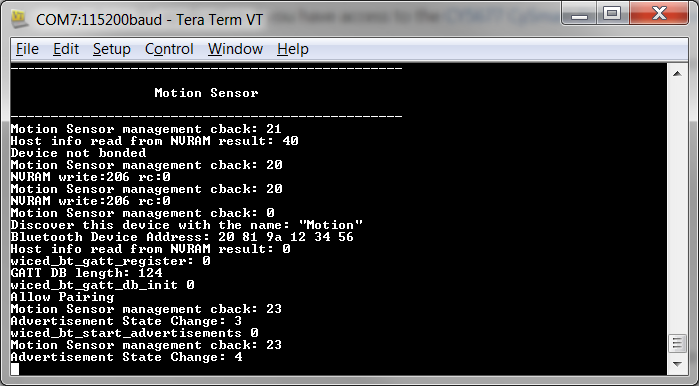

5.	Do the following to test a connection using the CySmart mobile app.

    1.	Turn ON Bluetooth on your Android or iOS device.

    2.	Launch the CySmart app.

    3.	Swipe down on the CySmart app home screen to start scanning for BLE Peripherals; your device appears in the CySmart app home screen. Select your device to establish a BLE connection.

        ##### Figure 2. Scanning for BLE Peripherals
        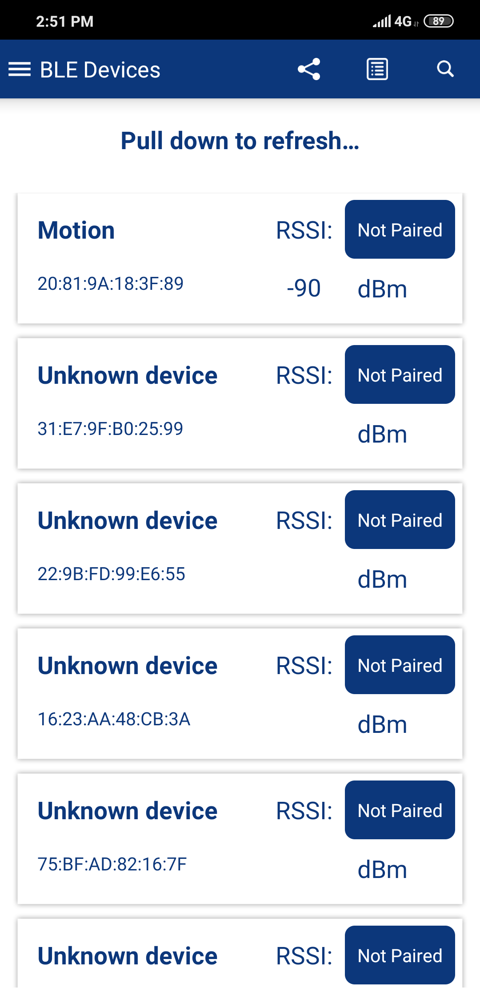

    4.	Select **GATT DB** from the carousel view. 

        ##### Figure 3. GATT DB
        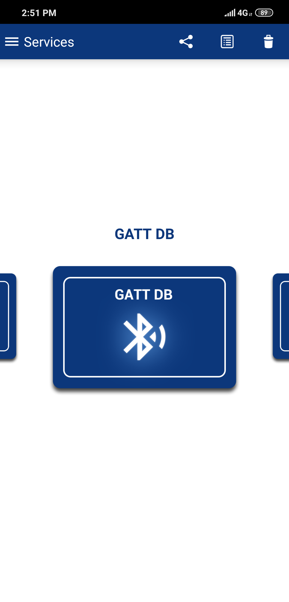

    5.	Select **Unknown Service** and then select **Characteristics**. 
        
        This will trigger a pairing request. Allow the pairing when prompted. You might have to either type the passcode shown on your mobile device into the Tera Term terminal or compare the passcode displayed on your device to the one printed on Tera Term terminal.

        ##### Figure 4. Selecting Services
        

    6.	Select **Notify**. 
        
        The BLE server device will start sending GATT notifications to the mobile device. It will also print the sensor values on Tera Term terminal. If the kit is stationary, the notifications will stop. To restart the notifications, give the kit a small jerk.

        ##### Figure 5. Notification Details
        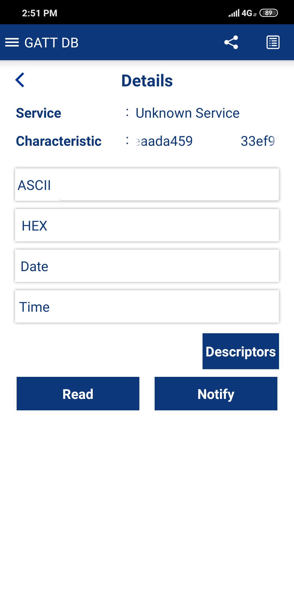

    7.	Disconnect the Bluetooth connection by backing out from the mobile app. 
        
        The device will start directed advertisement. You can either connect using the same BLE Client device or press the SW3 button to start undirected advertisement to connect with another BLE Client device.

        ##### Figure 6. Sensor Values
        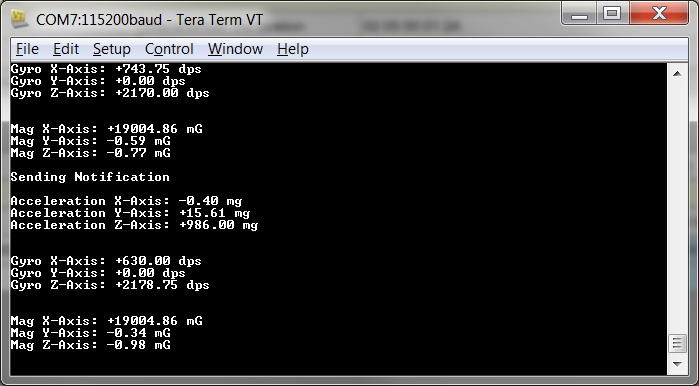

6. Do the following to test using the CySmart desktop application on a PC. See  the *CySmart User Guide* to learn how to use this application.
    
    1. Open the CySmart desktop application and connect to the CySmart CY5677 dongle (Central device).

    2.	**Scan** and **Connect** to 'Motion' device. When asked for a connection parameter update, accept it.

    3.	Click **Pair** to pair the devices. 
        
        Pairing will either require you to enter the passcode shown on the CySmart desktop application to Tera into the Tera Term terminal or compare and accept the passcode shown on the CySmart desktop application and Tera Term terminal.

    4.	Add the device to the resolving list when prompted.

    5.	Go to the device tab and click **Discover all attributes**.

    6.	Click **Enable all Notifications**. 
        
        The BLE GATT Server device will start sending GATT notifications. It will also print the sensor values on TeraTerm. If the kit is stationary, the notifications will stop. To restart the notifications, give the kit a small jerk.

    8.	Click **Disconnect** to disconnect from the Central device. 
        
        The device will start directed advertisement. You can either connect using the same BLE Client device or press the SW3 button to start undirected advertisement to connect with another BLE Client device.

## Design and Implementation

This code example implements a GATT Server and GAP Peripheral role on the CYW208xx/CYW207xx device. Once the device is powered ON, it boots up and does the following things:

1.	Initializes the Bluetooth stack
2.	Initializes PUART for input
3.	Initializes I2C
4.	Registers the motion sensor interrupt
5.	Registers a button interrupt
6.	Initializes the Idle timer and Notification timer
7.	Reads the NVRAM to see if bond data exists
8.	Registers the GATT database and GATT events callback
9.	Initializes the motion sensor
10.	Starts undirected or directed advertisements based on the bond data present

You can now connect to the device using a GAP Central device. Upon connection, the device will request connection parameters to be updated (specifically, the connection interval to 100 ms). If the request is accepted, the connection interval changes to 100 ms. 

The GAP Central device needs to send a pairing request. The GAP Central can now discover all attributes and enable GATT notifications. The Peripheral will start sending motion sensor values every second for 10 seconds. If the board is stationary after 10 seconds, the notifications will stop. To restart the notifications, the board needs to be given a little jerk.

The GATT Server implements a custom Service with a custom characteristic. This characteristic is readable and notifiable.

Application-level source files for this code example are listed in the following table:

|**File Name**|**Comments**|
|-----------------------------------|-------------------------------------------------------|
|*motion_sensor.c*|Entry to the application. It initializes the PUART for debugging and then initializes the controller stack.|
|*motion_sensor_ble.c*|Handles BLE initialization, configuration, advertisement, notifications, and responses to BLE events. It also manages the timers, button, and interrupt callbacks.|
|*motion_sensor_hw.c*|Handles the hardware for the project.|
*app_bt_cfg.c*|Has the BLE-related parameters.|
|*Lsm9ds1_reg.c*|Contains device drivers for LSM9DS1 motion sensor.|

## Flowcharts

The following images show the code flow.

##### Figure 7. Bootup Flow

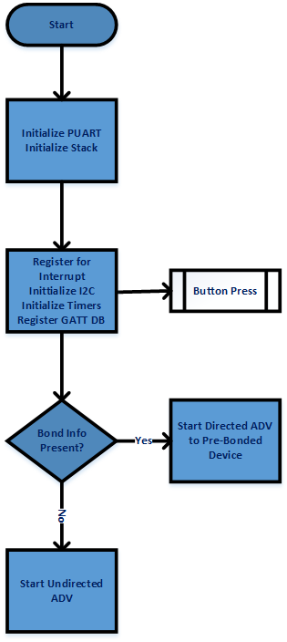

##### Figure 8. Connection Up Event

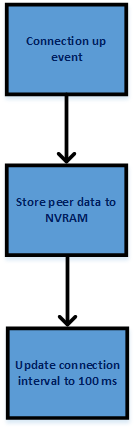

##### Figure 9. Pairing Event

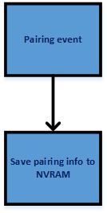

##### Figure 10. Notifications and Motion Sensor Interrupt

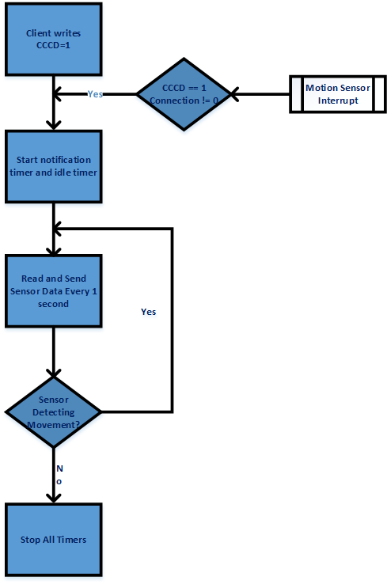


##### Figure 11. Connection Down Event

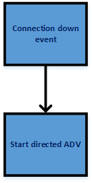


##### Figure 12. Button Press

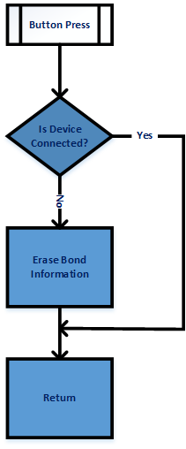


## Related Resources

| Application Notes||
|--|--|
| [AN225684](http://www.cypress.com/an225684):  Getting Started with CYW208xx | Describes CYW208xx device and how to build your first ModusToolbox project |

|Code Examples|
|--|
|Visit the [Cypress GitHub repo](https://www.cypress.com/mtb-github) for a comprehensive collection of code examples using ModusToolbox IDE|

|Development Kit Documentation|
|--|
|[CYW20819EVB-02 Evaluation Kit](http://www.cypress.com/CYW920819EVB-02)|

|Tools Documentation||
|--|--|
|[ModusToolbox IDE](http://www.cypress.com/modustoolbox)| The ModusToolbox cross-platform IDE simplifies development for IoT designers. Look in <ModusToolbox install>/docs.|

## Document History

Document Title: DMS title here

| Revision | Submission Date | Description of Change |
| -------- | --------------- | --------------------- |
| **       |    10/16/1019   | New code example      |


All other trademarks or registered trademarks referenced herein are the property of their respective owners.


-------------------------------------------------------------------------------

© Cypress Semiconductor Corporation, 2019. This document is the property of Cypress Semiconductor Corporation and its subsidiaries ("Cypress"). This document, including any software or firmware included or referenced in this document ("Software"), is owned by Cypress under the intellectual property laws and treaties of the United States and other countries worldwide. Cypress reserves all rights under such laws and treaties and does not, except as specifically stated in this paragraph, grant any license under its patents, copyrights, trademarks, or other intellectual property rights. If the Software is not accompanied by a license agreement and you do not otherwise have a written agreement with Cypress governing the use of the Software, then Cypress hereby grants you a personal, non-exclusive, nontransferable license (without the right to sublicense) (1) under its copyright rights in the Software (a) for Software provided in source code form, to modify and reproduce the Software solely for use with Cypress hardware products, only internally within your organization, and (b) to distribute the Software in binary code form externally to end users (either directly or indirectly through resellers and distributors), solely for use on Cypress hardware product units, and (2) under those claims of Cypress's patents that are infringed by the Software (as provided by Cypress, unmodified) to make, use, distribute, and import the Software solely for use with Cypress hardware products. Any other use, reproduction, modification, translation, or compilation of the Software is prohibited.  
TO THE EXTENT PERMITTED BY APPLICABLE LAW, CYPRESS MAKES NO WARRANTY OF ANY KIND, EXPRESS OR IMPLIED, WITH REGARD TO THIS DOCUMENT OR ANY SOFTWARE OR ACCOMPANYING HARDWARE, INCLUDING, BUT NOT LIMITED TO, THE IMPLIED WARRANTIES OF MERCHANTABILITY AND FITNESS FOR A PARTICULAR PURPOSE. No computing device can be absolutely secure. Therefore, despite security measures implemented in Cypress hardware or software products, Cypress shall have no liability arising out of any security breach, such as unauthorized access to or use of a Cypress product. CYPRESS DOES NOT REPRESENT, WARRANT, OR GUARANTEE THAT CYPRESS PRODUCTS, OR SYSTEMS CREATED USING CYPRESS PRODUCTS, WILL BE FREE FROM CORRUPTION, ATTACK, VIRUSES, INTERFERENCE, HACKING, DATA LOSS OR THEFT, OR OTHER SECURITY INTRUSION (collectively, "Security Breach"). Cypress disclaims any liability relating to any Security Breach, and you shall and hereby do release Cypress from any claim, damage, or other liability arising from any Security Breach. In addition, the products described in these materials may contain design defects or errors known as errata which may cause the product to deviate from published specifications. To the extent permitted by applicable law, Cypress reserves the right to make changes to this document without further notice. Cypress does not assume any liability arising out of the application or use of any product or circuit described in this document. Any information provided in this document, including any sample design information or programming code, is provided only for reference purposes. It is the responsibility of the user of this document to properly design, program, and test the functionality and safety of any application made of this information and any resulting product. "High-Risk Device" means any device or system whose failure could cause personal injury, death, or property damage. Examples of High-Risk Devices are weapons, nuclear installations, surgical implants, and other medical devices. "Critical Component" means any component of a High-Risk Device whose failure to perform can be reasonably expected to cause, directly or indirectly, the failure of the High-Risk Device, or to affect its safety or effectiveness. Cypress is not liable, in whole or in part, and you shall and hereby do release Cypress from any claim, damage, or other liability arising from any use of a Cypress product as a Critical Component in a High-Risk Device. You shall indemnify and hold Cypress, its directors, officers, employees, agents, affiliates, distributors, and assigns harmless from and against all claims, costs, damages, and expenses, arising out of any claim, including claims for product liability, personal injury or death, or property damage arising from any use of a Cypress product as a Critical Component in a High-Risk Device. Cypress products are not intended or authorized for use as a Critical Component in any High-Risk Device except to the limited extent that (i) Cypress's published data sheet for the product explicitly states Cypress has qualified the product for use in a specific High-Risk Device, or (ii) Cypress has given you advance written authorization to use the product as a Critical Component in the specific High-Risk Device and you have signed a separate indemnification agreement.  
Cypress, the Cypress logo, Spansion, the Spansion logo, and combinations thereof, WICED, PSoC, CapSense, EZ-USB, F-RAM, and Traveo are trademarks or registered trademarks of Cypress in the United States and other countries. For a more complete list of Cypress trademarks, visit cypress.com. Other names and brands may be claimed as property of their respective owners.