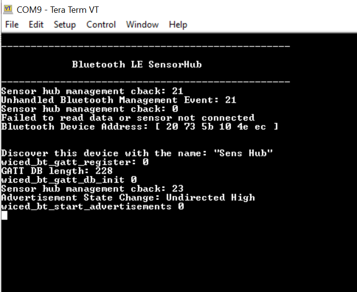

# BTSDK - Sensor Hub

This example demonstrates multiple sensors (motion sensor, 3D magnetic sensor, and thermistor) interfaced with Cypress CYW208xx and CYW207xx Bluetooth SoCs using ModusToolbox® software.

**Note:** This code example can also be used with PSoC 6 BLE kits programmed with the [PSoC 6 BLE Wi-Fi Gateway code example](https://github.com/cypresssemiconductorco/mtb-example-psoc6-ble-wifi-gateway). The PSoC 6 BLE Wi-Fi gateway collects sensors data over GATT notification, displays it on the TFT screen, and publishes it to the cloud.

## Requirements

- [ModusToolbox® software](https://www.cypress.com/products/modustoolbox-software-environment) v2.2
    **Note:** This code example version requires ModusToolbox software version 2.2 or later and is not backward compatible with v2.1 or older versions. If you cannot move to ModusToolbox v2.2, use the latest compatible version of this example: [latest-v1.X](https://github.com/cypresssemiconductorco/mtb-example-btsdk-ble-sensorhub/tree/latest-v1.X).
- Board Support Package (BSP) minimum required version: 2.8.0
- Programming Language: C

- Associated Parts:
   - [CYW20819](https://www.cypress.com/datasheet/CYW20819)
   - [CYW20820](https://www.cypress.com/datasheet/CYW20820)
   - [CYW20719](https://www.cypress.com/documentation/datasheets/cyw20719-enhanced-low-power-bredrble-bluetooth-50-soc)
   - [CYW20735](https://www.cypress.com/documentation/datasheets/cyw20735b1-single-chip-bluetooth-transceiver-wireless-input-devices)

## Supported Toolchains (make variable 'TOOLCHAIN')

- GNU Arm® Embedded Compiler v9.3.1 (GCC_ARM) - Default value of `TOOLCHAIN`

## Supported Kits (make variable 'TARGET')
-  [CYW920819EVB-02 Evaluation Kit](http://www.cypress.com/CYW920819EVB-02) - Default target
-  [CYW920820EVB-02 Evaluation kit](http://www.cypress.com/CYW920820EVB-02)
-  [CYW920719B2Q40EVB-01 Evaluation kit](https://community.cypress.com/docs/DOC-17736)
-  [CYW920735Q60EVB-01 Evaluation kit](http://www.cypress.com/CYW920735Q60EVB-01)
-  [S2GO 3D SENSE TLV493D](https://www.infineon.com/cms/en/product/evaluation-boards/s2go_3d-sense_tlv493d/)
-  [My IoT Adapter](https://www.infineon.com/cms/en/product/evaluation-boards/my-iot-adapter/)
-  [Rotate Knob 3D 2 Go Kit](https://www.infineon.com/cms/en/product/evaluation-boards/rotate-knob-3d-2-go-kit/)

## Hardware Setup

This example uses the board's default configuration. Refer to the kit user guide to ensure that the board is configured correctly.

The CYW20819 and CYW20820 base boards come with motion sensor and thermistor. The 3D Magnetic Sensor shield board needs to be plugged into the Arduino connector of the base boards through the My IoT adapter board.

**Figure 1. Board Setup**


## Software Setup

Install a terminal emulator if you don't have one. Instructions in this document use [Tera Term](https://ttssh2.osdn.jp/index.html.en). All other required software come bundled with the Eclipse IDE for ModusToolbox.

To use a Windows PC as the BLE Central device for the GATT Client application, install [CySmart Host Emulation Tool](https://www.cypress.com/documentation/software-and-drivers/cysmart-bluetooth-le-test-and-debug-tool). You will also need [CY5677 CySmart BLE 4.2 USB Dongle](http://www.cypress.com/documentation/development-kitsboards/cy5677-cysmart-bluetooth-low-energy-ble-42-usb-dongle).

To use an iOS or Android smartphone as the BLE Central device, download the CySmart app. Scan the following QR codes from your mobile phone to download the CySmart app.


This example requires no additional software or tools.

## Using the Code Example

### In Eclipse IDE for ModusToolbox:

1. Click the **New Application** link in the **Quick Panel** (or, use **File** > **New** > **ModusToolbox Application**). This launches the [Project Creator](http://www.cypress.com/ModusToolboxProjectCreator) tool.

2. Pick a kit supported by the code example from the list shown in the **Project Creator - Choose Board Support Package (BSP)** dialog.

   When you select a supported kit, the example is reconfigured automatically to work with the kit. To work with a different supported kit later, use the [Library Manager](https://www.cypress.com/ModusToolboxLibraryManager) to choose the BSP for the supported kit. You can use the Library Manager to select or update the BSP and firmware libraries used in this application. To access the Library Manager, click the link from the Quick Panel.

   You can also just start the application creation process again and select a different kit.

   If you want to use the application for a kit not listed here, you may need to update the source files. If the kit does not have the required resources, the application may not work.
3. In the **Project Creator - Select Application** dialog, choose the **Sensor Hub** application by enabling the checkbox.

4. Optionally, change the suggested **New Application Name**.

5. Enter the local path in the **Application(s) Root Path** field to indicate where the application needs to be created.

   Applications that can share libraries can be placed in the same root path.

6. Click **Create** to complete the application creation process.

For more details, see the [Eclipse IDE for ModusToolbox User Guide](https://www.cypress.com/MTBEclipseIDEUserGuide) (locally available at *{ModusToolbox install directory}/ide_{version}/docs/mt_ide_user_guide.pdf*).


### In Command-line Interface (CLI):

ModusToolbox provides the Project Creator as both a GUI tool and a command line tool to easily create one or more ModusToolbox applications. See the "Project Creator Tools" section of the [ModusToolbox User Guide](https://www.cypress.com/ModusToolboxUserGuide) for more details.

Alternatively, you can manually create the application using the following steps.
1. Download and unzip this repository onto your local machine, or clone the repository.

2. Open a CLI terminal and navigate to the application folder.

   On Linux and macOS, you can use any terminal application. On Windows, open the **modus-shell** app from the Start menu.

   **Note:** The cloned application contains a default BSP file (*TARGET_xxx.mtb*) in the *deps* folder. Use the [Library Manager](https://www.cypress.com/ModusToolboxLibraryManager) (`make modlibs` command) to select and download a different BSP file, if required. If the selected kit does not have the required resources or is not [supported](#supported-kits-make-variable-target), the application may not work.

3. Import the required libraries by executing the `make getlibs` command.

Various CLI tools include a `-h` option that prints help information to the terminal screen about that tool. For more details, see the [ModusToolbox User Guide](https://www.cypress.com/ModusToolboxUserGuide) (locally available at *{ModusToolbox install directory}/docs_{version}/mtb_user_guide.pdf*).


### In Third-party IDEs:

1. Follow the instructions from the [CLI](#in-command-line-interface-cli) section to create the application, and import the libraries using the `make getlibs` command.

2. Export the application to a supported IDE using the `make <ide>` command from the *mtb-example-btsdk-sensorhub* folder.

    For a list of supported IDEs and more details, see the "Exporting to IDEs" section of the [ModusToolbox User Guide](https://www.cypress.com/ModusToolboxUserGuide) (locally available at *{ModusToolbox install directory}/docs_{version}/mtb_user_guide.pdf*.

3. Follow the instructions displayed in the terminal to create or import the application as an IDE project.

## Operation

### Using CySmart Desktop Application as BLE Central:

1. Connect the board to your PC using the provided USB cable through the USB connector.

2. Open any serial terminal program and select the WICED PUART COM port. Set the serial port parameters to 8N1 and 115200 baud.

3. Program the board with the *mtb-example-btsdk-sensorhub* application.

   - **Using Eclipse IDE for ModusToolbox:**

      1. Select the application project in the Project Explorer.

      2. In the **Quick Panel**, scroll down, and click **\<Application Name> Program (KitProg3_MiniProg4)**.

   - **Using CLI:**

     From the terminal, execute the `make program` command to build and program the application using the default toolchain to the default target. You can specify a target and toolchain manually:
      ```
      make program TARGET=<BSP> TOOLCHAIN=<toolchain>
      ```

      Example:
      ```
      make program TARGET=CY8CPROTO-062-4343W TOOLCHAIN=GCC_ARM
      ```

4. After programming, the application starts automatically. Confirm that 'Sensor hub' is displayed on the UART terminal and it will start advertising.

   **Figure 2. Terminal Output for Sensor Hub During Advertising**

   

5. Open the [CySmart desktop application](https://www.cypress.com/documentation/software-and-drivers/cysmart-bluetooth-le-test-and-debug-tool) and connect to the [CySmart CY5677 dongle](http://www.cypress.com/cy5677) (Central device).

   See the [CySmart user guide](https://www.cypress.com/file/232316/download) to learn how to use the desktop application.

6. Using the CySmart desktop application, **scan** and **connect** to the 'Sens Hub' device.

7. If prompted, click **Yes** to update the connection parameters.

8. Go to the **Device** tab and click **Discover all attributes**.

9. Click **Enable all Notifications**.

   Sensor values are displayed on the UART terminal.

10. Click **Disable All Notifications** to stop reading the sensor values.

11. Click **Disconnect** to disconnect from the Central device.


### Using CySmart iOS/Android App on Smartphone as BLE Central

1. Connect the board to your PC using the provided USB cable through the USB connector.

2. Open any serial terminal program and select the WICED PUART COM port. Set the serial port parameters to 8N1 and 115200 baud.

3. Program the board with the *mtb-example-btsdk-sensorhub* application.

   - **Using Eclipse IDE for ModusToolbox:**

      1. Select the application project in the Project Explorer.

      2. In the **Quick Panel**, scroll down, and click **\<Application Name> Program (KitProg3_MiniProg4)**.

   - **Using CLI:**

     From the terminal, execute the `make program` command to build and program the application using the default toolchain to the default target. You can specify a target and toolchain manually:
      ```
      make program TARGET=<BSP> TOOLCHAIN=<toolchain>
      ```

      Example:
      ```
      make program TARGET=CY8CPROTO-062-4343W TOOLCHAIN=GCC_ARM
      ```

4. After programming, the application starts automatically. Confirm that 'Sensor hub' is displayed on the UART terminal and it will start advertising.

   **Figure 2. Terminal Output for Sensor Hub During Advertising**
   

5. Turn ON Bluetooth on your Android or iOS device and launch the CySmart app.

6. Swipe down on the CySmart app home screen to start scanning for BLE Peripherals; your device appears in the CySmart app home screen with the name 'Sens Hub'`. Select your device to establish a BLE connection (see Figure 3).

7. Select **GATT DB** from the carousel view. Swipe left or right to change carousel selections.

8. Select **Unknown Service** and then select the Characteristic with the **Notify** property.

9. Select **Notify**. The device will start sending GATT notifications to the mobile.

   **Figure 3. CySmart App**

   

   Sensor values will be displayed on the UART terminal as follows.

   **Figure 4. Sensor Values**

   

## Design and Implementation

### Introduction

This code example implements a GATT Server and GAP Peripheral role, ADC, and I2C on the CYW208xx/CYW207xx device. Once the device is powered ON, it boots up and does the following:

1. Initializes the Bluetooth stack
2. Initializes PUART for input
3. Initializes I2C and ADC
4. Registers a button interrupt
5. Initializes the notification timer for all sensors
6. Registers the GATT database and GATT events callback
7. Initializes all sensors
8. Starts undirected or directed advertisements based on the bond data present

You can now connect to the device using a GAP Central device. Upon connection, the device will request connection parameters to be updated (specifically, the connection interval to 100 ms). If the request is accepted, the connection interval changes to 100 ms.

The GAP Central can now discover all attributes and enable GATT notifications. The Peripheral will start sending sensor values with the defined interval. Moving the board or rotating the knobs changes the values in the console output.

The GATT Server implements a custom service with a custom characteristic. This characteristic is readable and notifiable.

The application-level source files for this code example are listed in [Table 1](#Table-1-Application-Source-Files):

**Table 1. Application Source Files**

|**File Name**|**Description**|
|-----------------------------------|-------------------------------------------------------|
| *sensor_hub.c* | Entry to the application. It initializes the PUART for debugging. |
| *sensor_hub_ble.c* | Handles BLE initialization, configuration, advertisement, notifications, and responses to BLE events. It also manages the timers, button, and interrupt callbacks.|
| *motion_sensor_hw.c* |Handles hardware configuration for motion sensors.|
| *mag3d_sensor_hw.c* |Handles the hardware for the 3D magnetic sensor.|
| *temp_sensor_hw.c* |Handles the hardware and ADC measurements for reading the temperature.|
| *app_bt_cfg.c* | Runtime Bluetooth stack configuration parameters.|
| *Lsm9ds1_reg.c* |Contains device drivers for the LSM9DS1 motion sensor.|

**Figure 11. Application Flowchart for Sensor Hub**


## Resources and Settings

This section explains the ModusToolbox resources and their configuration as used in this code example. Note that all the configuration explained in this section has already been done in the code example. Eclipse IDE for ModusToolbox stores the configuration settings of the application in the *design.modus* file. This file is used by the graphical configurators, which generate the configuration firmware. This firmware is stored in the application’s *GeneratedSource* folder.

* **Device Configurator:** The Device Configurator is used to enable/configure the peripherals and the pins used in the application. See the
[Device Configurator Guide](https://www.cypress.com/ModusToolboxDeviceConfig).

* **Bluetooth Configurator:** The Bluetooth Configurator is used for generating/modifying the BLE GATT database. See the
[Bluetooth Configurator Guide](https://www.cypress.com/ModusToolboxBLEConfig).

## Related Resources

| Application Notes                                            |                                                              |
| :----------------------------------------------------------- | :----------------------------------------------------------- |
| [AN225684](http://www.cypress.com/an225684):  Getting Started with CYW208xx | Describes CYW208xx device and how to build your first ModusToolbox project |
|**Code Examples**| Visit the [Cypress GitHub repo](https://www.cypress.com/mtb-github) for a comprehensive collection of code examples using Eclipse IDE for ModusToolbox|
|**Device Documentation**|
|[CYW20819 Device Datasheet](https://www.cypress.com/datasheet/CYW20819)|
|[CYW20820 Device Datasheet](https://www.cypress.com/datasheet/CYW20820)|
|[CYW20719 Device Datasheet](https://www.cypress.com/documentation/datasheets/cyw20719-enhanced-low-power-bredrble-bluetooth-50-soc)|
|[CYW20735 Device Datasheet](https://www.cypress.com/documentation/datasheets/cyw20735b1-single-chip-bluetooth-transceiver-wireless-input-devices)|
|[TLV493DA1B6 Datasheet](https://www.infineon.com/cms/en/product/sensor/magnetic-sensors/magnetic-position-sensors/3d-magnetics/tlv493d-a1b6/)|
|**Development Kits**|
|[CYW920819EVB-02 Evaluation Kit](http://www.cypress.com/CYW920819EVB-02)|
|[CYW920820EVB-02 Evaluation Kit](http://www.cypress.com/CYW920820EVB-02)|
|[CYW920719B2Q40EVB-01 Evaluation kit](https://community.cypress.com/docs/DOC-17736)|
|[CYW920735Q60EVB-01 Evaluation kit](http://www.cypress.com/CYW920735Q60EVB-01)|
|[S2GO_3D-SENSE_TLV493D Evaluation Board](https://www.infineon.com/cms/en/product/evaluation-boards/s2go_3d-sense_tlv493d/)|
|**Tools**|
|[Eclipse IDE for ModusToolbox](https://www.cypress.com/modustoolbox)    | The cross-platform, Eclipse-based IDE for IoT designers that supports application configuration and development targeting converged MCU and wireless systems.             |
## Other Resources

Cypress provides a wealth of data at www.cypress.com to help you select the right device, and quickly and effectively integrate it into your design.
## Document History

Document Title: *CE228683* - *Sensor Hub*

| Version | Description of Change |
| ------- | --------------------- |
| 1.0.0   | New code example      |
| 1.1.0   | Reconnection issue resolved      |
| 1.2.0   | New features added with multiple sensor      |
| 2.0.0   | Major update to support ModusToolbox software v2.2, This version is not backward compatible with ModusToolbox software v2.1      |
------

All other trademarks or registered trademarks referenced herein are the property of their respective owners.


-------------------------------------------------------------------------------

© Cypress Semiconductor Corporation, 2020. This document is the property of Cypress Semiconductor Corporation and its subsidiaries ("Cypress"). This document, including any software or firmware included or referenced in this document ("Software"), is owned by Cypress under the intellectual property laws and treaties of the United States and other countries worldwide. Cypress reserves all rights under such laws and treaties and does not, except as specifically stated in this paragraph, grant any license under its patents, copyrights, trademarks, or other intellectual property rights. If the Software is not accompanied by a license agreement and you do not otherwise have a written agreement with Cypress governing the use of the Software, then Cypress hereby grants you a personal, non-exclusive, nontransferable license (without the right to sublicense) (1) under its copyright rights in the Software (a) for Software provided in source code form, to modify and reproduce the Software solely for use with Cypress hardware products, only internally within your organization, and (b) to distribute the Software in binary code form externally to end users (either directly or indirectly through resellers and distributors), solely for use on Cypress hardware product units, and (2) under those claims of Cypress's patents that are infringed by the Software (as provided by Cypress, unmodified) to make, use, distribute, and import the Software solely for use with Cypress hardware products. Any other use, reproduction, modification, translation, or compilation of the Software is prohibited.
TO THE EXTENT PERMITTED BY APPLICABLE LAW, CYPRESS MAKES NO WARRANTY OF ANY KIND, EXPRESS OR IMPLIED, WITH REGARD TO THIS DOCUMENT OR ANY SOFTWARE OR ACCOMPANYING HARDWARE, INCLUDING, BUT NOT LIMITED TO, THE IMPLIED WARRANTIES OF MERCHANTABILITY AND FITNESS FOR A PARTICULAR PURPOSE. No computing device can be absolutely secure. Therefore, despite security measures implemented in Cypress hardware or software products, Cypress shall have no liability arising out of any security breach, such as unauthorized access to or use of a Cypress product. CYPRESS DOES NOT REPRESENT, WARRANT, OR GUARANTEE THAT CYPRESS PRODUCTS, OR SYSTEMS CREATED USING CYPRESS PRODUCTS, WILL BE FREE FROM CORRUPTION, ATTACK, VIRUSES, INTERFERENCE, HACKING, DATA LOSS OR THEFT, OR OTHER SECURITY INTRUSION (collectively, "Security Breach"). Cypress disclaims any liability relating to any Security Breach, and you shall and hereby do release Cypress from any claim, damage, or other liability arising from any Security Breach. In addition, the products described in these materials may contain design defects or errors known as errata which may cause the product to deviate from published specifications. To the extent permitted by applicable law, Cypress reserves the right to make changes to this document without further notice. Cypress does not assume any liability arising out of the application or use of any product or circuit described in this document. Any information provided in this document, including any sample design information or programming code, is provided only for reference purposes. It is the responsibility of the user of this document to properly design, program, and test the functionality and safety of any application made of this information and any resulting product. "High-Risk Device" means any device or system whose failure could cause personal injury, death, or property damage. Examples of High-Risk Devices are weapons, nuclear installations, surgical implants, and other medical devices. "Critical Component" means any component of a High-Risk Device whose failure to perform can be reasonably expected to cause, directly or indirectly, the failure of the High-Risk Device, or to affect its safety or effectiveness. Cypress is not liable, in whole or in part, and you shall and hereby do release Cypress from any claim, damage, or other liability arising from any use of a Cypress product as a Critical Component in a High-Risk Device. You shall indemnify and hold Cypress, its directors, officers, employees, agents, affiliates, distributors, and assigns harmless from and against all claims, costs, damages, and expenses, arising out of any claim, including claims for product liability, personal injury or death, or property damage arising from any use of a Cypress product as a Critical Component in a High-Risk Device. Cypress products are not intended or authorized for use as a Critical Component in any High-Risk Device except to the limited extent that (i) Cypress's published data sheet for the product explicitly states Cypress has qualified the product for use in a specific High-Risk Device, or (ii) Cypress has given you advance written authorization to use the product as a Critical Component in the specific High-Risk Device and you have signed a separate indemnification agreement.
Cypress, the Cypress logo, Spansion, the Spansion logo, and combinations thereof, WICED, PSoC, CapSense, EZ-USB, F-RAM, and Traveo are trademarks or registered trademarks of Cypress in the United States and other countries. For a more complete list of Cypress trademarks, visit cypress.com. Other names and brands may be claimed as property of their respective owners.
